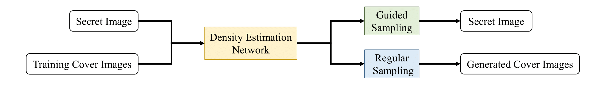

# Hiding Images in Deep Probabilistic Models



## Introduction
This repository contains the reference code for the paper [Hiding Images in Deep Probabilistic Models](https://arxiv.org/abs/2210.02257), Haoyu Chen, Linqi Song, Zhenxing Qian, Xinpeng Zhang, Kede Ma, Advances in Neural Information Processing Systems, 2022.

Data hiding with deep neural networks (DNNs) has experienced impressive successes in recent years. A prevailing scheme is to train an autoencoder, consisting of an encoding network to embed (or transform) secret messages in (or into) a carrier, and a decoding network to extract the hidden messages. This scheme may suffer from several limitations regarding practicability, security, and embedding capacity. In this work, we describe a different computational framework to hide images in deep probabilistic models. Specifically, we use a DNN to model the probability density of cover images, and hide a secret image in one particular location of the learned distribution. As an instantiation, we adopt a SinGAN, a pyramid of generative adversarial networks (GANs), to learn the patch distribution of one cover image. We hide the secret image by fitting a deterministic mapping from a fixed set of noise maps (generated by an embedding key) to the secret image during patch distribution learning. The stego SinGAN, behaving as the original SinGAN, is publicly communicated; only the receiver with the embedding key is able to extract the secret image.

## Prerequisites
* python 3.7

* pytorch 1.1.0

* ``pip install -r requirements.txt``

## Dataset

## Training
* To train one model using one secret-cover image pair: 
```bash
python train_model.py
```

* To training 200 models using 200 secret-cover image pairs: 
```bash
python train_multiple_models.py
```

* The trained models will be saved in ``./TrainedModels`` directory.

## Evaluation
* An example of trained model is in ``./test-model`` directory.

* To evaluate the trained model by random sampling: 
```bash
python evaluate_model_random_sampling.py
```

* To evaluate the trained model by extracting secret image: 
```bash
python evaluate_model_secret_extraction.py
```

* The randomly sampled images and the extracted secret image will be saved in ``./test-model/Evaluation`` directory.

* The codes for calculating PSNR, SSIM, DISTS, SIFID, DS and KLD are provided in ``./Evaluation`` directory.

## Hiding Multiple Images
* To hide 2 secret images: 
```bash
python ./HidingMultipleImages/Hiding2Images/train_hiding2images.py
```

* To hide 3 secret images: 
```bash
python ./HidingMultipleImages/Hiding3Images/train_hiding3images.py
```

* To hide 4 secret images: 
```bash
python ./HidingMultipleImages/Hiding4Images/train_hiding4images.py
```

* The resulting models will be saved in ``./HidingMultipleImages/HidingxImages/TrainedModels`` directory, where "x" is the number of hidden secret images.

## Reference SinGAN without Hiding Image
* To train reference SinGAN without hiding any secret image: 
```bash
python ./NotHidingImage/train_original.py
```

* The trained reference models will be saved in ``./NotHidingImage/TrainedModels`` directory.

## Citation
```
@inproceedings{chen2022hiding,
title={Hiding Images in Deep Probabilistic Models},
author={Haoyu Chen and Linqi Song and Zhenxing Qian and Xinpeng Zhang and Kede Ma},
booktitle={Advances in Neural Information Processing Systems},
year={2022}
}
```
## Acknowledgment
The authors would like to thank Tobias Hinz for his implementation of ["Improved Techniques for Training Single-Image GANs"](https://github.com/tohinz/ConSinGAN) in PyTorch.
